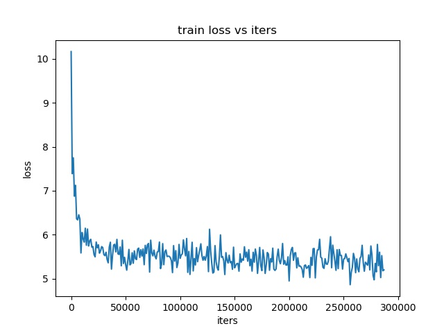
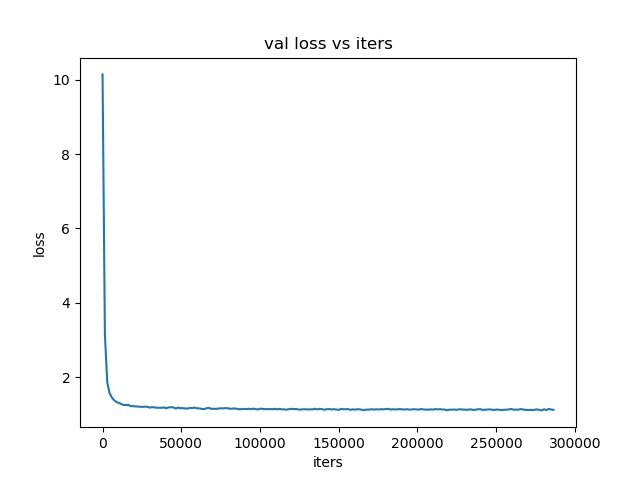
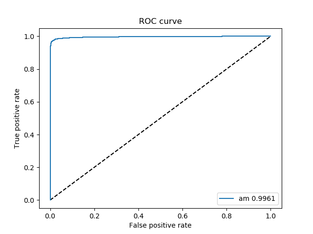

# 前言

基于AMsoftmax的人脸识别网络。

论文来源：[Amsoftmax](https://arxiv.org/abs/1801.05599)

论文笔记：[我的博客](http://www.luameows.wang/2018/12/04/%E8%AE%BA%E6%96%87%E7%AC%94%E8%AE%B0-AMSoftmax/#more)

caffe来源：[happyNear](https://github.com/happynear/caffe-windows)

# preprocess

人脸检测与对齐采用[MTCNN](https://github.com/xialuxi/arcface-caffe)，同一缩放到112x96大小，黑白图片。对应代码`crop_align.py`。

训练数据集采用WebFace，共10575个人。基于`clean-list.txt`对数据集进行清洗。原始数据集一共有494414张图片，清洗后数据集有455594张图片，经过mtcnn预处理之后剩余图片445739张。

未进行数据集均衡与扩充处理。

`create_lmdb.sh`用于将数据集生成lmdb格式。

训练集与测试集比例为4:1。

# train

训练采用模型文件`train_val.prototxt`。

对应solver配置文件`solver.prototxt`。

采用[mirror trick](https://github.com/happynear/NormFace/blob/master/MirrorFace.md)进行前向计算的特征提取，对应模型文件`deploy_mirror.prototxt`。

调用`train.sh`进行模型训练。

# log

训练log文件记录为`train.log`。调用`parse_log.py`会生成`train.train`与`train.test`。

调用`plot_loss.py`绘制loss曲线。

# test

调用`create_feature_LFW.py`提取6000对lfw图片特征。

调用`accuracy_LFW6000.py`计算准确率，`cal_roc.py`绘制roc曲线。

最终准确率`98.05%`，最佳门限`0.625`，ROC曲线AUC值`0.9961`。

